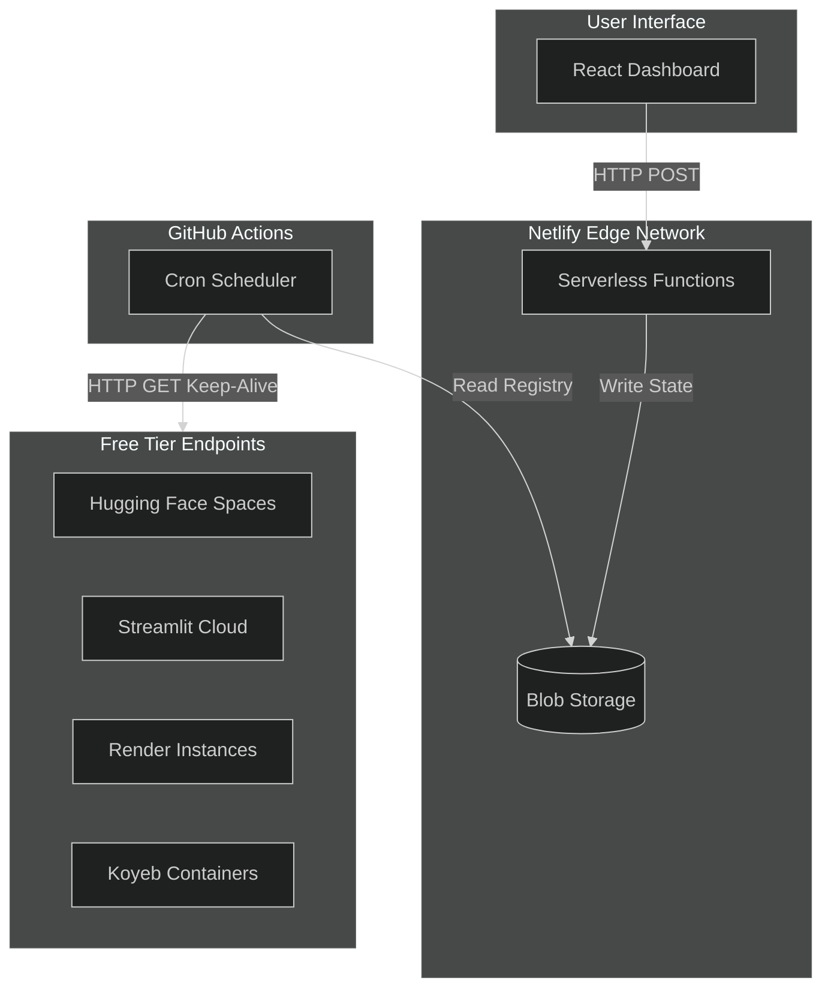

<div align="center">
<picture>
  <source media="(prefers-color-scheme: dark)" srcset="https://see.fontimg.com/api/rf5/dE0g/NmU5ZTRmNmJkZGFkNDMzNjg3YWFmMjk2NjUzMGY4YTEudHRm/UGluZyBDb2xkIFN0YXJ0/beautiful-people-personal-use.png?r=fs&h=65&w=1000&fg=FFFFFF&bg=00000000&tb=1&s=65">
  
</picture>🥶🥶🥶


    


<br>

<table>
<tr>
<td width="50%" valign="top">

### Mission
Serverless free tiers suspend idle applications. This registry maintains active states via distributed cron execution. Zero gatekeeping. Zero fees.

</td>
<td width="50%" valign="top">

### Telemetry


</td>
</tr>
</table>

</div>

---

<div align="center">

### Infrastructure Matrix

| Domain | Stack |
| :--- | :--- |
| **Interface** | React, Tailwind CSS |
| **Edge Compute** | Netlify Functions |
| **State Management** | Netlify Blobs |
| **Orchestration** | GitHub Actions Cron |

</div>

---

### System Topology



---

### Supported Targets

<table>
<tr>
<td align="center" width="25%">
<b>Hugging Face</b><br>

<br><sub>CPU/GPU Sleep: 48h</sub>
</td>
<td align="center" width="25%">
<b>Streamlit</b><br>

<br><sub>Inactivity Sleep: 7d</sub>
</td>
<td align="center" width="25%">
<b>Render</b><br>

<br><sub>Spin Down: 15m</sub>
</td>
<td align="center" width="25%">
<b>Koyeb</b><br>

<br><sub>Free Tier Scaling</sub>
</td>
</tr>
</table>


---

### Deployment & Execution

**Prerequisites**
- Node.js (v18+)
- `pnpm` package manager

**Initialization**
```bash
git clone https://github.com/your-username/ping-cold-start.git
cd ping-cold-start
pnpm install
```

**Local Execution**
```bash
pnpm start
```

---

### Environment Configuration

**Local Variables** `.env`
```env
REACT_APP_API_URL=/.netlify/functions/todos
BLOB_STORE_NAME=<your_store_name>
BLOB_LIST_KEY=<your_list_key>
```

**Repository Secrets** GitHub Actions
| Variable | Description | Example |
| :--- | :--- | :--- |
| `SITE_URL` | Base URL of the deployed registry | `https://ping-cold-start.netlify.app` |

---

<div align="center">

### Documentation & Resources

[Development Learnings](./LEARNINGS.md)

<br>

<sub>Built by programmers, for programmers. 🐱‍💻</sub>

</div>
